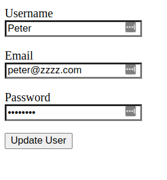

# Rails Programming

## PROJECT: RE-FORMER

## Introduction

In this project we created a simple form system following the instructions from [Odin](https://www.theodinproject.com/courses/ruby-on-rails/lessons/forms).
We used basic concepts of Ruby on Rails including:

- Models, Views, and Controllers (MVC)
- Data Structures & Relationships
- Routing
- Migrations
- Views with forms, partials, and helpers
- RESTful design
- Adding gems for extra features

## To install and run

- Clone the project repo from [GitHub](https://github.com/krishnzzz/re-former.git) using `git clone https://github.com/krishnzzz/re-former.git`
- Make sure [Ruby-lang](https://www.ruby-lang.org/en/) is installed
- Make sure [Bundler](https://bundler.io/) is installed
- Install the required gems. Run `bundle install`
- Install the required node packages. Run `yarn install`
- Install the local database. Run `rake db:migrate`
- If you have problems with the ruby versions try installing [RVM](https://rvm.io/)
- Launch a Rails Server using `rails server`
- Open your browser and go to `127.0.0.1:3000` or `localhost:3000`

## Blog app

This is a simple app where you can create users, and edit their details.

The main page will display all the created users.

To create a new user press the 'New User' button in the page. There you can add a username, email and password.

You can edit the user just clicking on its username on the main page.

## Designed With
- Ruby
- Rails
- Git
- Gitflows
- Rubocop
- VS Code

## Contribute to this Project

Contributions, issues, and feature requests are welcome! Start by:

  - Forking the project
  - Cloning the project to your local machine
  - cd into the project directory
  - Run git checkout -b your-branch-name
  - Make your contributions
  - Push your branch up to your forked repository
  - Open a Pull Request with a detailed description of the development branch of the original project for a review

## Authors

👤 **Angel Barros**

- GitHub: [@Zappat0n](https://github.com/Zappat0n)
- LinkedIn: [LinkedIn](https://www.linkedin.com/in/angel-barros/)

👤 **Suyash Fowdar**
- Github: [@Krishnzzz](https://github.com/krishnzzz)
- LinkedIn: [Suyash Fowdar](https://www.linkedin.com/in/suyash-fowdar-22b89514a/)

## Show your support

Give a ⭐️ if you like this project!
